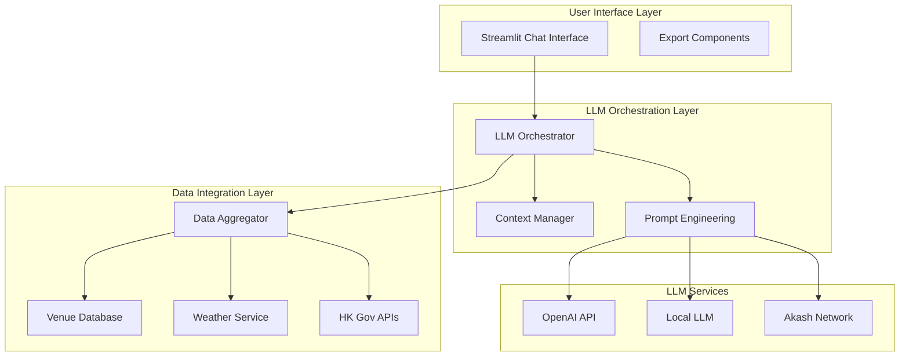

# Design Document

## Overview

HK Travel Planner is built as a conversational AI application using Streamlit, with Large Language Models as the core intelligence layer. The system uses a chat-based interface where users describe their travel needs naturally, and the LLM generates contextual, accessible itineraries by reasoning over Hong Kong venue data and real-time information.

The architecture emphasizes LLM-driven decision making, with structured data sources providing the factual foundation for AI reasoning. The system maintains conversation context to enable iterative refinement of travel plans through natural dialogue.

## Architecture

### LLM-Centric Architecture



### Conversation Flow Architecture

The system maintains conversation state and context to enable natural interaction:

1. **User Input Processing**: Natural language parsing and intent recognition
2. **Context Enrichment**: Adding relevant venue and weather data to conversation context
3. **LLM Reasoning**: Generating responses with structured itinerary data
4. **Response Formatting**: Converting LLM output to user-friendly displays
5. **State Management**: Maintaining conversation history and user preferences

## Components and Interfaces

### Core Models

#### Conversation Context
```python
@dataclass
class ConversationContext:
    user_preferences: Dict[str, Any]
    current_itinerary: Optional[Itinerary]
    conversation_history: List[Message]
    venue_data: List[Venue]
    weather_data: Optional[WeatherInfo]
    session_id: str
```

#### LLM Request
```python
@dataclass
class LLMRequest:
    user_message: str
    context: ConversationContext
    system_prompt: str
    response_format: str
    max_tokens: int
```

#### Structured Itinerary Output
```python
@dataclass
class ItineraryResponse:
    days: List[DayPlan]
    explanation: str
    accessibility_notes: List[str]
    cost_breakdown: CostSummary
    modifications_made: List[str]
```

### Service Layer Components

#### LLMOrchestrator
**Responsibilities:**
- Coordinate LLM interactions with data sources
- Manage conversation flow and context
- Handle LLM response parsing and validation
- Implement fallback strategies for LLM failures

**Key Methods:**
- `process_user_message(message, context)`: Main conversation handler
- `generate_itinerary(preferences, context)`: Structured itinerary generation
- `modify_itinerary(changes, current_itinerary)`: Itinerary modification logic
- `explain_recommendation(venue, context)`: Generate explanations for choices

#### ContextManager
**Responsibilities:**
- Maintain conversation state across interactions
- Enrich context with relevant data
- Manage session persistence
- Handle context window optimization for LLMs

**Key Methods:**
- `update_context(user_input, llm_response)`: Context state updates
- `get_relevant_venues(preferences)`: Context-aware venue filtering
- `optimize_context_window()`: Manage token limits efficiently

#### PromptEngineering
**Responsibilities:**
- Generate system prompts for different conversation stages
- Format data for LLM consumption
- Implement prompt templates for consistency
- Handle response format specifications

**Key Methods:**
- `create_system_prompt(stage, context)`: Dynamic prompt generation
- `format_venue_data(venues)`: Structure venue data for LLM
- `create_response_schema()`: Define expected output format

### Data Integration Components

#### DataAggregator
**Responsibilities:**
- Combine data from multiple sources for LLM context
- Cache frequently accessed data
- Handle data source failures gracefully
- Provide structured data summaries

**Key Methods:**
- `get_contextual_data(preferences)`: Aggregate relevant data
- `refresh_data_cache()`: Update cached information
- `validate_data_quality()`: Ensure data accuracy

#### VenueDatabase
**Purpose:** Curated Hong Kong venues with complete accessibility information optimized for LLM reasoning.

**Data Structure:**
- Structured venue descriptions for LLM consumption
- Accessibility features in natural language format
- Cost information with discount details
- Operating hours and seasonal variations

## LLM Integration Strategy

### Multi-Model Support
The system supports multiple LLM providers with automatic fallback:

1. **Primary**: OpenAI GPT-4 for complex reasoning
2. **Secondary**: Akash Network for cost-effective operations
3. **Fallback**: Local models for offline capability

### Prompt Engineering Approach

#### System Prompts
- **Itinerary Generation**: Specialized prompts for creating accessible travel plans
- **Conversation Management**: Prompts for natural dialogue flow
- **Data Interpretation**: Prompts for processing venue and weather data
- **Explanation Generation**: Prompts for creating user-friendly explanations

#### Response Formatting
- **Structured JSON**: For itinerary data that needs processing
- **Natural Language**: For explanations and conversations
- **Hybrid Format**: Combining structured data with explanations

### Context Window Management
- **Conversation Summarization**: Compress long conversations while preserving key information
- **Relevant Data Selection**: Include only pertinent venue and weather data
- **Progressive Context Building**: Add context incrementally based on conversation flow

## Error Handling and Fallbacks

### LLM Service Failures
1. **Primary LLM Unavailable**: Automatically switch to secondary provider
2. **All LLM Services Down**: Fall back to rule-based itinerary generation
3. **Response Parsing Errors**: Request regeneration with clearer format specifications
4. **Context Window Exceeded**: Implement intelligent context compression

### Data Source Integration
1. **Weather API Failures**: Use cached weather data with timestamps
2. **Government API Issues**: Fall back to curated offline data
3. **Database Connection Problems**: Use in-memory venue data

### User Experience Continuity
- **Session Recovery**: Restore conversation context after interruptions
- **Graceful Degradation**: Inform users of reduced functionality
- **Alternative Suggestions**: Provide options when preferred choices unavailable

## Testing Strategy

### LLM Response Testing
1. **Output Format Validation**: Ensure LLM responses match expected schemas
2. **Content Quality Assessment**: Validate accessibility and safety of recommendations
3. **Conversation Flow Testing**: Test multi-turn dialogue scenarios
4. **Edge Case Handling**: Test with unusual or conflicting user requirements

### Integration Testing
1. **Data Source Integration**: Test with various API response scenarios
2. **Multi-Model Fallback**: Verify seamless switching between LLM providers
3. **Context Management**: Test conversation state persistence and recovery
4. **Performance Testing**: Monitor response times and token usage

### Accessibility Testing
1. **Recommendation Accuracy**: Verify LLM suggestions meet accessibility requirements
2. **Explanation Quality**: Test clarity and usefulness of AI-generated explanations
3. **User Journey Testing**: Test complete workflows with various accessibility needs
4. **Fallback Scenario Testing**: Ensure accessibility maintained during service degradation

The design emphasizes the LLM as the central intelligence layer while maintaining reliability through structured data sources and comprehensive fallback mechanisms.