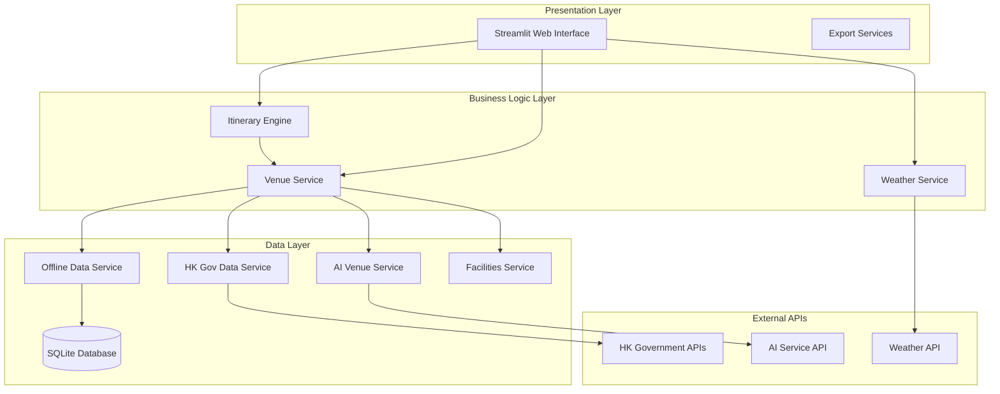

# Design Document

## Overview

SilverJoy Planner HK is designed as a modular, AI-enhanced web application built on Streamlit that serves families and seniors visiting Hong Kong. The system leverages multiple data sources including Hong Kong government APIs, offline curated data, and AI-generated recommendations to create personalized, accessible itineraries.

The architecture emphasizes reliability through layered data sources, accessibility-first design principles, and graceful degradation when external services are unavailable. The application uses a service-oriented architecture with clear separation of concerns between data acquisition, processing, and presentation layers.

## Architecture

### High-Level Architecture



### Data Flow Architecture

The system implements a multi-tier data strategy:

1. **Offline Data (Tier 1)**: 31 curated venues with complete accessibility information
2. **Database Cache (Tier 2)**: SQLite database for persistent storage and quick access
3. **Government APIs (Tier 3)**: Real-time data from Hong Kong official sources
4. **AI Enhancement (Tier 4)**: Dynamic venue generation based on user preferences

This tiered approach ensures the application always has reliable data while providing enhanced experiences when external services are available.

## Components and Interfaces

### Core Models

#### Venue Model
```python
@dataclass
class Venue:
    id: str
    name: str
    category: VenueCategory
    location: Location
    accessibility: AccessibilityInfo
    dietary_options: DietaryOption
    cost_range: Tuple[int, int]
    weather_suitability: WeatherSuitability
    # Additional metadata fields
```

#### User Preferences Model
```python
@dataclass
class UserPreferences:
    family_composition: Dict[str, int]
    mobility_needs: List[str]
    dietary_restrictions: List[str]
    budget_range: Tuple[int, int]
    trip_duration: int
    transportation_preference: List[str]
```

#### Itinerary Model
```python
@dataclass
class Itinerary:
    day_plans: List[DayPlan]
    total_cost: float
    cost_breakdown: CostBreakdown
    accessibility_score: float
    user_preferences: UserPreferences
```

### Service Layer Components

#### VenueService
**Responsibilities:**
- Aggregate venues from multiple data sources
- Apply accessibility and dietary filtering
- Manage data source prioritization and caching
- Provide AI-enhanced venue recommendations

**Key Methods:**
- `get_all_venues()`: Returns combined venues from all sources
- `get_ai_enhanced_venues(preferences, weather)`: AI-generated venues
- `search_venues(criteria)`: Filtered venue search
- `get_accessible_venues(needs)`: Accessibility-focused filtering

#### ItineraryEngine
**Responsibilities:**
- Generate day-by-day itineraries based on user preferences
- Optimize venue selection for accessibility and budget
- Calculate transportation routes and costs
- Apply weather-based recommendations

**Key Methods:**
- `generate_itinerary(preferences, weather)`: Main itinerary generation
- `_select_daily_venues()`: AI logic for venue selection
- `_calculate_accessibility_score()`: Accessibility rating calculation

#### WeatherService
**Responsibilities:**
- Fetch current Hong Kong weather data
- Provide weather-based activity recommendations
- Cache weather data to reduce API calls

#### AIVenueService
**Responsibilities:**
- Generate contextual venue recommendations using LLM
- Enhance existing venue data with AI insights
- Provide fallback when government APIs are unavailable

**Integration:**
- Uses OpenAI-compatible API (Akash Network endpoint)
- Implements caching to reduce API costs
- Graceful degradation when AI service unavailable

### Data Services

#### OfflineDataService
**Purpose:** Provides reliable baseline of 31 curated Hong Kong venues with complete accessibility information.

**Data Structure:**
- Attractions: Victoria Peak, Star Ferry, Temple Street Night Market
- Museums: Hong Kong Museum of History, Science Museum
- Parks: Hong Kong Park, Kowloon Park
- Restaurants: Accessible dim sum and local cuisine options

#### HKGovDataService
**Purpose:** Integrates with official Hong Kong government APIs for real-time data.

**API Endpoints:**
- Tourism Board attractions and events
- Weather Observatory data
- MTR accessibility information
- Licensed restaurant database
- Public facility locations

#### FacilitiesService
**Purpose:** Provides information about public facilities like accessible toilets, rest areas, and mobility services.

## Data Models

### Accessibility Information Schema
```python
@dataclass
class AccessibilityInfo:
    has_elevator: bool
    wheelchair_accessible: bool
    accessible_toilets: bool
    step_free_access: bool
    parent_facilities: bool
    rest_areas: bool
    difficulty_level: int  # 1-5 scale
    accessibility_notes: List[str]
```

### Dietary Options Schema
```python
@dataclass
class DietaryOption:
    soft_meals: bool
    vegetarian: bool
    halal: bool
    no_seafood: bool
    allergy_friendly: bool
    dietary_notes: List[str]
```

### Database Schema
The SQLite database stores venue information with the following key tables:

**venues table:**
- Core venue information (id, name, category, location)
- Accessibility flags (wheelchair_accessible, has_elevator, etc.)
- Dietary options (soft_meals_available, vegetarian_options, etc.)
- Cost and operational data (cost_min, cost_max, opening_hours)

**user_sessions table (future):**
- Session management for personalized experiences
- Preference storage and retrieval

## Error Handling

### Graceful Degradation Strategy

1. **AI Service Unavailable:**
   - Fall back to curated offline venues
   - Display informational message about reduced personalization
   - Continue with full functionality using baseline data

2. **Government API Failures:**
   - Use cached data when available
   - Fall back to offline venue database
   - Log errors for monitoring without disrupting user experience

3. **Weather API Unavailable:**
   - Use default weather assumptions (indoor/outdoor balance)
   - Provide general weather-agnostic recommendations

4. **Database Connection Issues:**
   - Implement connection retry logic
   - Use in-memory fallback data for critical venues
   - Display appropriate error messages for data unavailability

### Error Logging and Monitoring

- Structured logging with different levels (INFO, WARNING, ERROR)
- Separate logging for cloud vs. local environments
- User-friendly error messages that don't expose technical details
- Performance monitoring for API response times

## Testing Strategy

### Unit Testing Approach

1. **Model Validation Tests:**
   - Test data model constraints and validation
   - Verify accessibility scoring algorithms
   - Test cost calculation logic

2. **Service Layer Tests:**
   - Mock external API dependencies
   - Test venue filtering and search functionality
   - Verify itinerary generation logic with various user preferences

3. **Integration Tests:**
   - Test data source integration and fallback mechanisms
   - Verify end-to-end itinerary generation workflows
   - Test export functionality (CSV/JSON)

### Accessibility Testing

1. **Venue Data Validation:**
   - Verify accessibility information accuracy
   - Test filtering logic for mobility requirements
   - Validate dietary restriction handling

2. **User Experience Testing:**
   - Test with various accessibility preference combinations
   - Verify appropriate venue recommendations for different mobility needs
   - Test cost calculations with senior/child discounts

### Performance Testing

1. **Data Loading Performance:**
   - Test venue loading times from different sources
   - Verify caching effectiveness
   - Monitor API response times

2. **Itinerary Generation Performance:**
   - Test generation speed with various trip durations
   - Verify memory usage with large venue datasets
   - Test concurrent user scenarios

### User Acceptance Testing

1. **Accessibility Scenarios:**
   - Test with wheelchair users
   - Test with seniors requiring soft meals
   - Test with families having children

2. **Budget Scenarios:**
   - Test various budget ranges
   - Verify cost accuracy and discount applications
   - Test export functionality for trip planning

### AI Service Testing

1. **AI Integration Tests:**
   - Test AI venue generation with various preferences
   - Verify fallback behavior when AI unavailable
   - Test caching and performance optimization

2. **Data Quality Tests:**
   - Validate AI-generated venue data structure
   - Test conversion from AI data to venue models
   - Verify accessibility information accuracy in AI responses

The testing strategy emphasizes reliability and accessibility, ensuring the application serves its target audience effectively even when external services are unavailable.